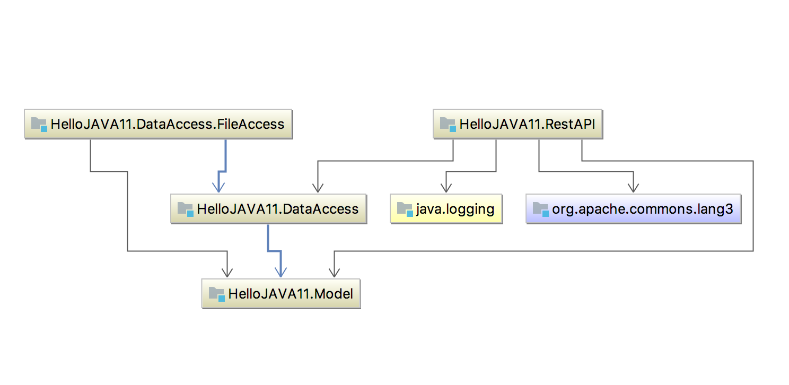

# Hello JAVA 11
[](https://travis-ci.org/xinhuagu/HelloJAVA11)
[](https://coveralls.io/github/xinhuagu/HelloJAVA11?branch=master&service=github)

The project shows how to use maven to build module-based java 11 progam

### Module diagram:


### buld & run :
```
./mvnw clean package
./run.sh
```

